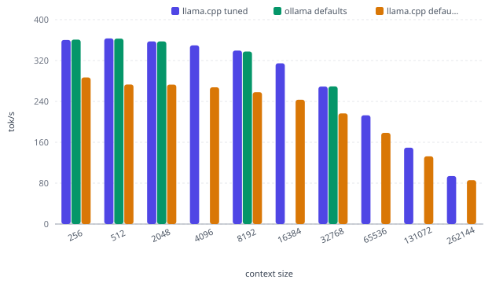

Qwen3.5-0.8B is a very small language model with under one billion parameters. At this size, it is not built for deep reasoning or broad knowledge, but for speed and efficiency. It fits comfortably on modest hardware and can run in real-time on mobile or edge devices. Its sweet spot lies in lightweight tasks where latency matters more than depth: routing requests, monitoring content, reranking results, or acting as a fast guardrail. Think of it as a quick first pass rather than a final answer.

## Configuration & Setup

The hardware setup stays identical throughout every test in this series. This fixed configuration lets you compare results across different model releases without hardware differences skewing the numbers.

| Component | Specification |
|-----------|---------------|
| CPU | Intel Core Ultra 7 265K |
| Motherboard | ASUS ROG MAXIMUS Z890 APEX - Intel Z890 |
| RAM | Kingston FURY Beast DDR5-5600 - 64GB (32 GB) |
| GPU | MSI GeForce RTX 5060 Ti (16 GB GDDR7) |
| System | Linux 6.17.0-35-generic |
| llama.cpp version | llama.cpp@b10068 |
| Ollama version | ollama@v0.32.1 |

## Straight to the Results

Qwen3.5-0.8b delivers excellent speed for short tasks but slows dramatically with longer contexts, making it best suited for brief conversations rather than document analysis.

The model consumes 0.16 kWh per million tokens processed.

| Metric                    | 512 Context | 32k Context | Max Context (262144) |
| ------------------------- | ----------- | ----------- | -------------------- |
| Prompt Processing (tok/s) | 12793       | 13782       | 5189                 |
| TTFT (ms)                 | 40          | 2s          | 50s                  |
| Decode Speed (tok/s)      | 362         | 268         | 94                   |

## Decode speed at context size

{fig-alt="Decode speed at context size"}

The decode speed, which measures how fast the model generates new text, drops noticeably as the context length grows. At a short context it's over 360 token per second, but at the maximum context it falls to about 94 tokens per second, meaning longer inputs make the model slower to respond. Prompt processing stays lightning fast for most contexts but also takes a clear hit at the maximum length.

## Conclusion

Running Qwen3.5-0.8B on a budget computer with an RTX 5060 Ti delivers genuinely practical performance for everyday AI tasks. Response times starting at 40 milliseconds mean near-instant replies for short queries, while even the heaviest workloads stay manageable. The decoding speeds—ranging from roughly 94 to 362 tokens per second—translate to reading faster than most people can scroll, with typical use falling comfortably in the middle. Where this setup truly stands out is efficiency: at 0.16 kWh per million tokens, you could process a full novel's worth of text for about two cents of electricity. For comparison, that's less power than running a desktop lamp for an hour. This makes the 0.8B model a sweet spot for developers, students, or small teams who need reliable AI assistance without cloud subscriptions or hardware upgrades.

## Further reading

For all the data, see the complete benchmark article. If you need context on how we started, read the previous article of the series. To see where this goes next, follow the next article of the series.
