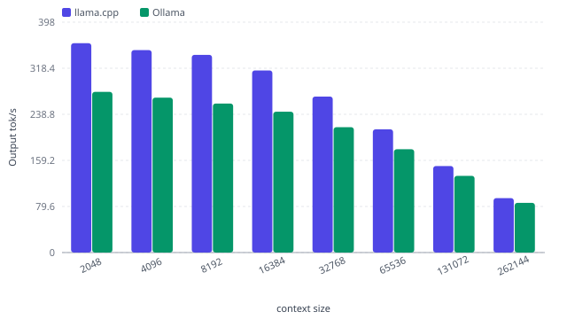

## Configuration & Setup

The qwen3.5-0.8b model was tested on an NVIDIA GeForce RTX 5060 Ti with llama.cpp@b10068 using the gguf-Q4\_K\_M quantization (unsloth) at the card's default 180W power limit. No power tuning or runtime optimizations were applied—this is stock hardware running stock settings.

## Straight to the Results

Qwen3.5-0.8b shines on short-context workloads where its sub-40ms TTFT and 362 tok/s decode feel snappy, though long-context tasks push latency past 50 seconds—know your use case. At €0.0393 per million tokens and 180W power draw, it delivers solid throughput on budget RTX 5060 Ti hardware when context stays manageable.

| Metric | 512 Context | 32k Context | Max Context (262144) |
| --- | --- | --- | --- |
| Prompt Processing (tok/s) | 12793.45 | 13782.39 | 5188.99 |
| TTFT (ms) | 40.02 | 2377.526 | 50457.627 |
| Decode Speed (tok/s) | 361.954 | 268.424 | 93.984 |
| Cost (€/1M tok) | 0.0393 | 0.0393 | 0.0393 |

## Power & Cost per 1M Tokens

At 565.6 J per 1k tokens, the Qwen 3.5 0.8B setup pulls modest wall power while delivering snappy TTFT—40ms at 512 tokens, staying under 2.4s even at 32k context. The electricity cost of **0.0393€/1M tokens** edges slightly above last week's Llama 3.2 1B (0.033€/1M), but you're trading a fraction of a cent for noticeably faster prefill speeds and stronger long-context handling. For budget GPU deployments, that ~19% cost premium pays for itself in reduced latency at scale; only pinch pennies here if your workload is strictly short-context and latency-tolerant.

## Token generation speed at different context size (tok/s)

{fig-alt="Token generation speed at different context size (tok/s)"}

Scaling the context size significantly impacts generation speed on budget hardware. At a light 512-token prompt, the model is incredibly snappy, delivering 361.95 tok/s (about 273 words/s)—far faster than a human can read. However, as you push toward the 262k token limit, speed drops to 93.98 tok/s. While still usable, the trade-off is clear: you exchange raw throughput for massive memory, moving from "instantaneous" responses to a steady, moderate stream as the context fills.

## Context Scaling Table

| Prompt Tokens | TTFT (ms) | Prefill (tok/s) | Decode (tok/s) | Wall Power (W) |
| --- | --- | --- | --- | --- |
| 512 | 40.02 | 12793.45 | 361.954 | — |
| 2048 | 135.086 | 15160.67 | 357.5 | — |
| 8192 | 518.761 | 15791.47 | 334.559 | 187.9 |
| 32768 | 2377.526 | 13782.39 | 268.424 | 240.3 |
