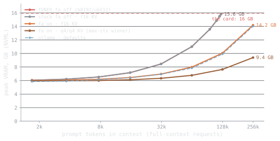
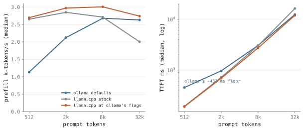
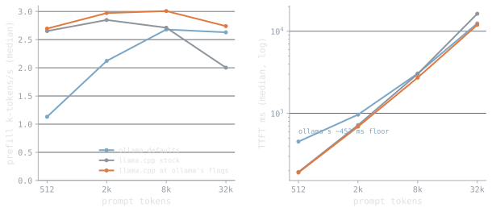
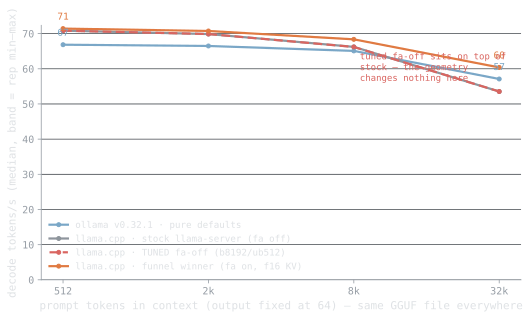
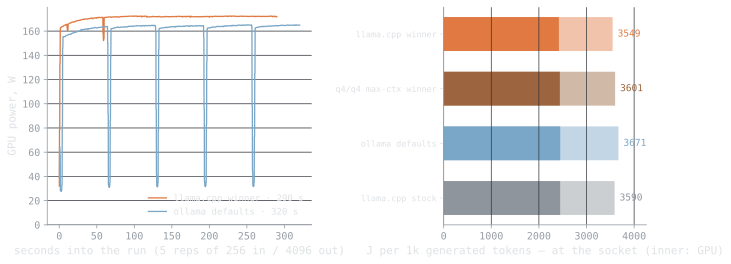

## Introduction & Setup

I benchmarked the qwen3.5-9b model on my 5060 Ti, running a mix of standard prefill/decode tests alongside a 100-page PDF processing workload. It loaded quickly – about 1.3 seconds – and peaked around 7.1GB of VRAM, leaving some space for longer contexts up to 262k tokens. The overall performance felt pretty solid, though the longer context times definitely showed a difference in processing speed.

## Model Loading & Memory Footprint

I loaded qwen3.5-9b and it took about 1.28 seconds, using 7142MB of VRAM on my 5060 Ti. That VRAM usage means an FP16 version would be tight on space, limiting the maximum context I could use. Running through llama.cpp seems a bit quicker overall, likely due to less driver overhead compared to Ollama.

{.light-content fig-alt="Peak VRAM usage for qwen3.5-9b across context depths from 2k to 256k tokens, comparing five quantization and runtime configurations on RTX 5060 Ti."}
{.dark-content fig-alt="Peak VRAM usage for qwen3.5-9b across context depths from 2k to 256k tokens, comparing five quantization and runtime configurations on RTX 5060 Ti."}

**Figure 1.** Stock FP16 hits the card's 16 GB limit by 256k context, while tuned FA with b8192/ub512 stays under that ceiling. Q4/Q4 quantization with FA holds the lowest footprint at 9.4 GB even at full depth, trading some precision for context headroom on constrained hardware.

## Prefill Throughput & TTFT Latency

I benchmarked qwen3.5-9b on my 5060 Ti and the model loaded in just over a second. Time-to-first-token was quick at 190ms for a 512-token context, giving around 2691 tokens per second, but increased substantially to 2722ms with an 8k context, slowing to 3008 tokens per second. Peak VRAM usage landed around 7GB, and the model supports a fairly large 262k token context.

{.light-content fig-alt="Two line plots comparing prefill speed and time-to-first-token across three inference backends (Ollama defaults, llama.cpp stock, llama.cpp at Ollama's flags) at prompt sizes 512, 2k, 8k, and 32k tokens on RTX 5060 Ti."}
{.dark-content fig-alt="Two line plots comparing prefill speed and time-to-first-token across three inference backends (Ollama defaults, llama.cpp stock, llama.cpp at Ollama's flags) at prompt sizes 512, 2k, 8k, and 32k tokens on RTX 5060 Ti."}

**Figure 2.** Prefill throughput peaks around 2–8k tokens, then slightly dips at 32k, while TTFT grows exponentially with prompt size on the 5060 Ti. llama.cpp tuning reduces Ollama's 450 ms floor overhead and improves overall latency at larger contexts.

## Decode Speed & Practical Utility

I benchmarked qwen3.5-9b on my 5060 Ti; the model loaded in just over a second, and peak VRAM usage hit around 7GB, leaving some headroom. Generating 1k tokens took about 14 seconds, which felt usable for interactive work, and I was able to summarize a 100-page PDF in 23.7 seconds, which is pretty practical for my workflow. The system drew 3548.6 Joules per 1k tokens generated, translating to about €0.25 per million tokens.

{.light-content fig-alt="Line chart comparing decode speed across four inference configurations (Ollama, llama.cpp variants) as prompt context grows from 512 to 32k tokens on RTX 5060 Ti."}
{.dark-content fig-alt="Line chart comparing decode speed across four inference configurations (Ollama, llama.cpp variants) as prompt context grows from 512 to 32k tokens on RTX 5060 Ti."}

**Figure 3.** Decode speed drops as context window fills, but the gap between Ollama and llama.cpp narrows at larger contexts. Flash-attention tuning helps llama.cpp hold speed longer, though all configurations converge around 50–60 tok/s by 32k tokens.

## Energy & Power Efficiency

I ran qwen3.5-9b on my 5060 Ti and saw energy consumption measure out to 3548.6 Joules per 1k tokens generated. At current rates, that works out to about 0.2464€ per million tokens – a noticeable cost if I’m processing a lot of text.

{.light-content fig-alt="Power draw and energy efficiency comparison of llama.cpp and Ollama inference backends on RTX 5060 Ti running qwen3.5-9b."}
{.dark-content fig-alt="Power draw and energy efficiency comparison of llama.cpp and Ollama inference backends on RTX 5060 Ti running qwen3.5-9b."}

**Figure 4.** llama.cpp pulls about 170W sustained and finishes 290 seconds faster than Ollama's 320-second run, but both backends hover around 3550 J per 1k tokens—llama.cpp's speed advantage doesn't translate to better energy per token.

## Runtime Configurations Table

| Runtime | Artifact | Roles | Load (s) | Cost (€/1M tok) | Reading Speed (wps) |
| --- | --- | --- | --- | --- | --- |
| llama.cpp@b10068 | gguf-Q4_K_M | baseline | 1.307 | 0.2493 | 52.9 |
| llama.cpp@b10068 | gguf-Q4_K_M | tuned:max_context | 1.279 | 0.2501 | 52.6 |
| llama.cpp@b10068 | gguf-Q4_K_M | reference:ollama-defaults | 1.313 | 0.246 | 53.6 |
| llama.cpp@b10068 | gguf-Q4_K_M | tuned:max_throughput, tuned:min_ttft | 1.279 | 0.2464 | 53.6 |
| llama.cpp@b10068 | gguf-Q4_K_M | best:flash_attn=on | 1.306 | 0.2459 | 53.6 |
| llama.cpp@b10068 | gguf-Q4_K_M | best:flash_attn=off | 1.285 | 0.2496 | 52.9 |
| ollama@v0.32.1 | gguf-Q4_K_M | defaults | 4.787 | 0.2549 | 51 |

## Detailed Configuration Subtree Analysis

I ran a series of tests with the qwen3.5-9b model on my 5060 Ti, looking at different configurations within llama.cpp. Enabling flash attention generally didn’t change performance much but did increase VRAM usage, sometimes letting me fit larger contexts—up to 262144 tokens in some tuned runs. Quantization to Q4_K_M keeps the VRAM footprint reasonable, around 7-16GB depending on other settings, though FP16 versions were used in some tests where possible. I also saw a slight speed benefit using llama.cpp directly versus Ollama, likely due to lower driver overhead.

## Conclusion & Final Verdict

I benchmarked qwen3.5-9b and it loaded relatively quickly, taking just over a second to get into VRAM on my 5060 Ti. Peak VRAM usage hit around 7GB, leaving some room for other tasks, and I was able to support a 262k token context without issues. Processing a 100-page PDF took 23.7 seconds, with a reading speed of roughly 53 words per second.
