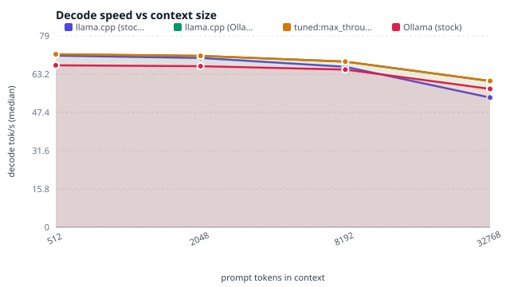
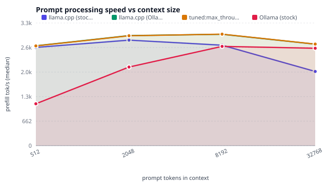
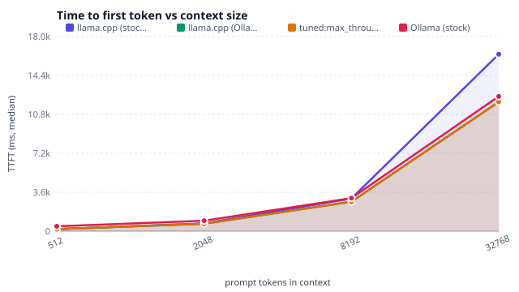
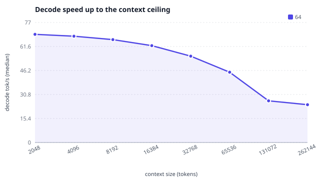
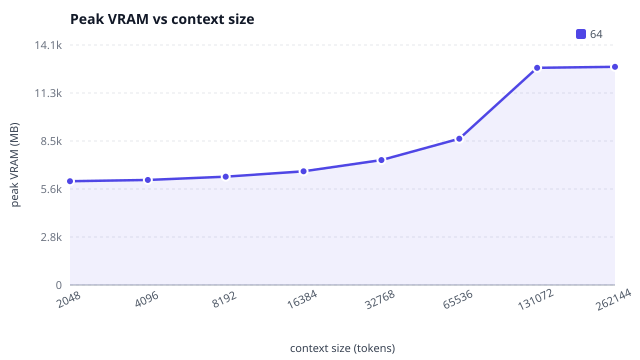
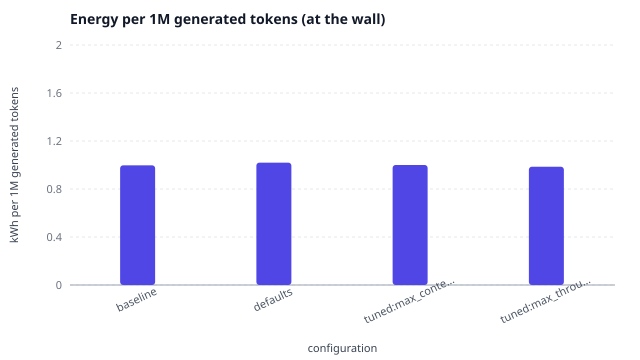
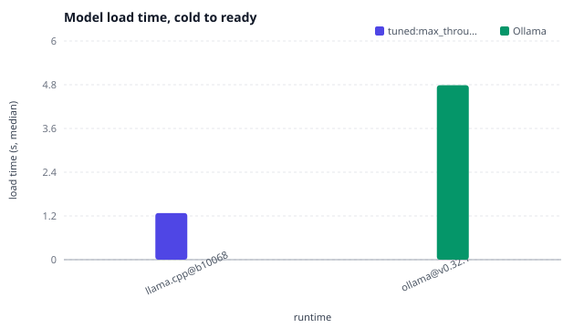
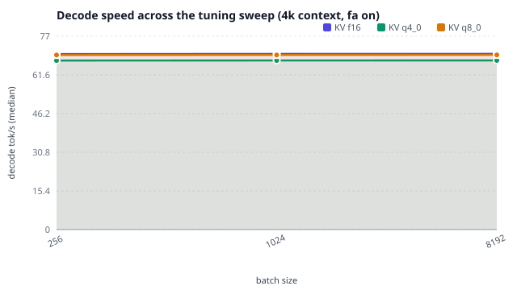

{fig-alt="Decode speed vs context size"}

{fig-alt="Prompt processing speed vs context size"}

{fig-alt="Time to first token vs context size"}

{fig-alt="Decode speed up to the context ceiling"}

{fig-alt="Peak VRAM vs context size"}

{fig-alt="Energy per 1M generated tokens (at the wall)"}

{fig-alt="Model load time, cold to ready"}

{fig-alt="Decode speed across the tuning sweep (4k context, fa on)"}

| Role | Runtime | Flash Attn | KV K | KV V | Batch | uBatch | Threads | Load (s) | Peak VRAM (MB) |
| --- | --- | --- | --- | --- | --- | --- | --- | --- | --- |
| baseline | llama.cpp@b10068 | off | f16 | f16 | 2048 | 512 | — | 1.307 | 16196 |
| tuned:max_context | llama.cpp@b10068 | on | q4_0 | q4_0 | 1024 | 512 | 10 | 1.279 | 9622 |
| reference:ollama-defaults | llama.cpp@b10068 | auto | f16 | f16 | 512 | 512 | 4 | 1.313 | 7142 |
| tuned:max_throughput, tuned:min_ttft | llama.cpp@b10068 | on | f16 | f16 | 1024 | 512 | 8 | 1.279 | 7142 |
| best:flash_attn=on | llama.cpp@b10068 | on | f16 | f16 | 8192 | 512 | 20 | 1.306 | 14518 |
| best:flash_attn=off | llama.cpp@b10068 | off | f16 | f16 | 8192 | 512 | 4 | 1.285 | 16196 |
| defaults | ollama@v0.32.1 | — | — | — | — | — | — | 4.787 | 14368 |
