<!-- llmbench:generated:begin meta hash=be8de53d0563 -->
| Provenance | |
|---|---|
| Model | `qwen3.5-0.8b`, unsloth GGUF Q4_K_M |
| Hardware profile | `budget` — 1x NVIDIA GeForce RTX 5060 Ti, 20 CPU cores |
| Runtimes | llama.cpp@b10068/gguf-Q4_K_M, ollama@v0.32.1/gguf-Q4_K_M |
| Benchmark version | `v1` |
| Results commit | `8779924` |
<!-- llmbench:generated:end meta -->

<!-- llmbench:commentary:begin intro -->
This is the first rung of the Qwen3.5 ladder on the budget tier: one RTX 5060 Ti, 16 GB, a model small enough that the card is never the constraint. That makes it the cleanest place to ask the question the whole series is built on — how much performance do default settings leave on the table, and which knobs actually move?
<!-- llmbench:commentary:end intro -->

<!-- llmbench:generated:begin outofbox hash=636e1211e91f -->
## Out of the box

Decode, out of the box
:   279.1 tokens/s at 512 tokens of context

Decode, tuned
:   371.3 tokens/s

Decode at 32k
:   217.7 out of the box, 268.8 tuned

Largest usable context
:   262 144 tokens

Cold start
:   4.29 s out of the box, 1.02 s tuned


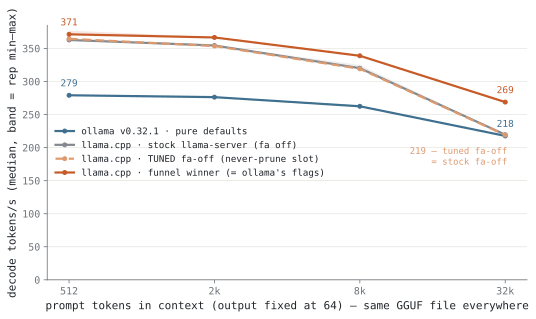{.light-content fig-alt="Line chart: decode tokens per second against context depth"}
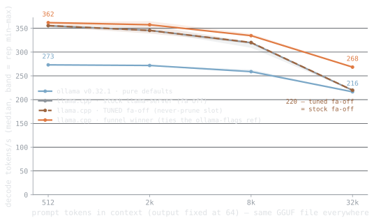{.dark-content fig-alt="Line chart: decode tokens per second against context depth"}

**Figure 1.** Decode speed against context depth — the same GGUF file in every run. Tuned llama.cpp holds 371.3 tokens/s at 512 tokens of context and 268.8 at 32k; ollama's defaults give 279.1 and 217.7, a +23.5 % gap at depth.

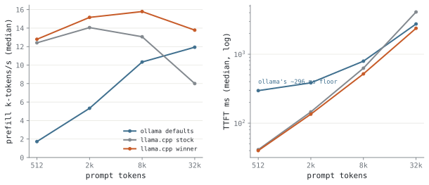{.light-content fig-alt="Two panels: prefill throughput and time-to-first-token vs depth"}
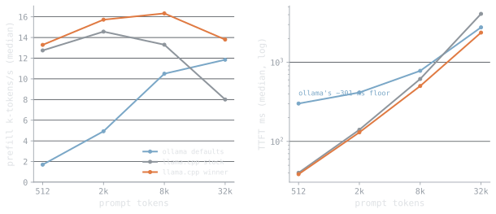{.dark-content fig-alt="Two panels: prefill throughput and time-to-first-token vs depth"}

**Figure 2.** Prompt processing and time-to-first-token. Tuned llama.cpp prefills at 13.8k tokens/s at 32k and answers a 512-token prompt in 38.5 ms, against ollama's 301.3 ms floor.
<!-- llmbench:generated:end outofbox -->

<!-- llmbench:commentary:begin outofbox-notes -->
*TODO — commentary.*
<!-- llmbench:commentary:end outofbox-notes -->

<!-- llmbench:generated:begin wrapper hash=67bed9ca2e73 -->
## In depth — the wrapper tax

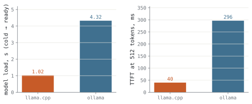{.light-content fig-alt="Bar chart: model load time and first-token latency per runtime"}
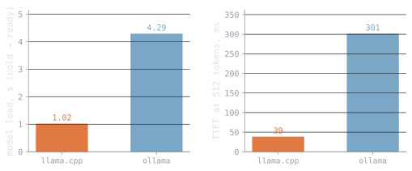{.dark-content fig-alt="Bar chart: model load time and first-token latency per runtime"}

**Figure 3.** Cold start and the fixed price of the wrapper. llama.cpp is serving 1.02 s after launch, ollama 4.29 s — a 3.27 s gap, plus 262.8 ms on every first token.
<!-- llmbench:generated:end wrapper -->

<!-- llmbench:commentary:begin wrapper-notes -->
*TODO — commentary.*
<!-- llmbench:commentary:end wrapper-notes -->

<!-- llmbench:generated:begin context hash=3dd0af6ce9be -->
## In depth — the knobs that change what you can run

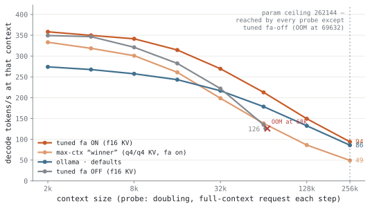{.light-content fig-alt="Line chart: decode speed along each configuration's context ladder"}
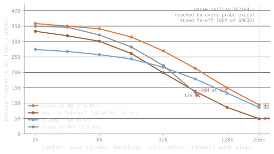{.dark-content fig-alt="Line chart: decode speed along each configuration's context ladder"}

**Figure 4.** Decode speed along each configuration's context ladder, out to the point where it stops. Speed at the limit is what decides whether a long context is usable rather than merely loadable: flash-attn on manages 92.5 tokens/s at 262 144 tokens; ollama defaults manages 84.6 tokens/s at 262 144 tokens; the max-context winner manages 48.5 tokens/s at 262 144 tokens; flash-attn off manages 28.5 tokens/s at 262 144 tokens; llama.cpp stock manages 28.4 tokens/s at 262 144 tokens.

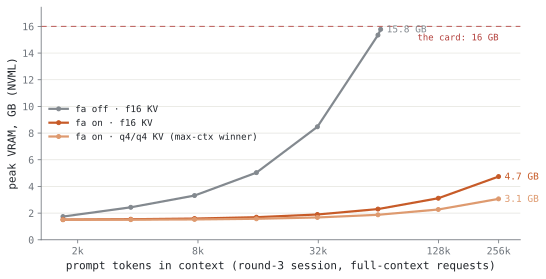{.light-content fig-alt="Line chart: peak VRAM against context depth per configuration"}
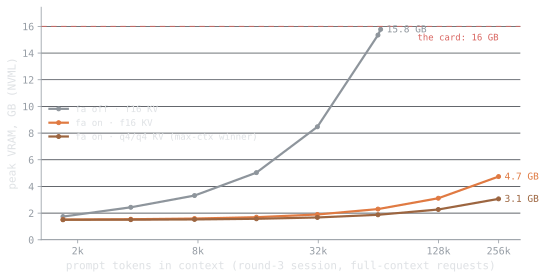{.dark-content fig-alt="Line chart: peak VRAM against context depth per configuration"}

**Figure 5.** Peak VRAM as context grows, and where each configuration stops: flash-attn off 11.33 GB, flash-attn on 5.10 GB, the max-context winner 3.43 GB at its deepest completed request.
<!-- llmbench:generated:end context -->

<!-- llmbench:commentary:begin context-notes -->
*TODO — commentary.*
<!-- llmbench:commentary:end context-notes -->

<!-- llmbench:generated:begin flat hash=dcf6e4854b96 -->
## In depth — the knobs that don't matter

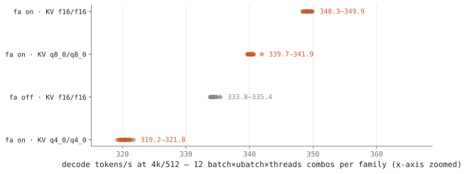{.light-content fig-alt="Strip plot: decode speed of every refine configuration, by family"}
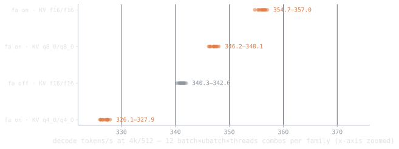{.dark-content fig-alt="Strip plot: decode speed of every refine configuration, by family"}

**Figure 6.** Every batch, micro-batch and thread combination the refine stage measured (48 configurations). Within a family the whole spread is 2.31 tokens/s; between families it is 31.0 — the flat knobs are flat, and the categorical ones are not.

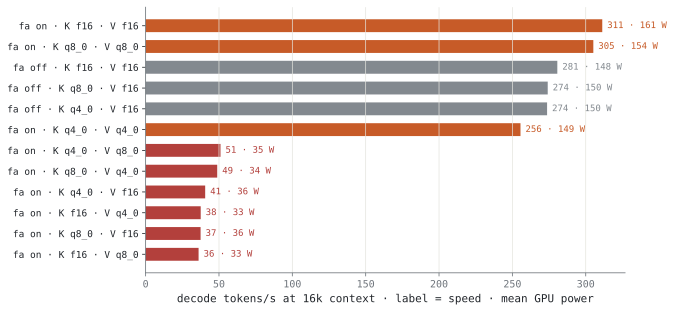{.light-content fig-alt="Bar chart: canary decode speed per KV-cache quantization, with power draw"}
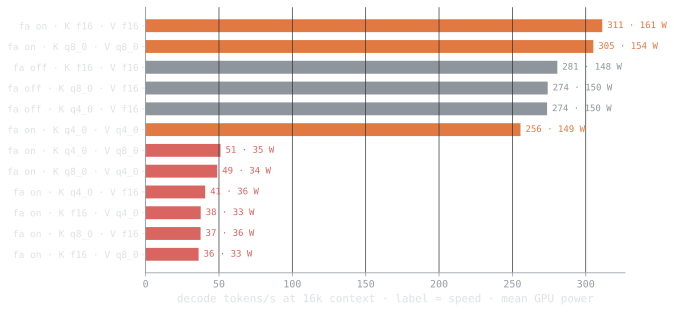{.dark-content fig-alt="Bar chart: canary decode speed per KV-cache quantization, with power draw"}

**Figure 7.** The KV-cache canary at 16k context. The spread is 8.62× (36.1 to 311.3 tokens/s) — the slow cluster is silently running on the CPU, which the power draw confirms.
<!-- llmbench:generated:end flat -->

<!-- llmbench:commentary:begin flat-notes -->
*TODO — commentary.*
<!-- llmbench:commentary:end flat-notes -->

<!-- llmbench:generated:begin power hash=3741c93a447d -->
## Power and energy

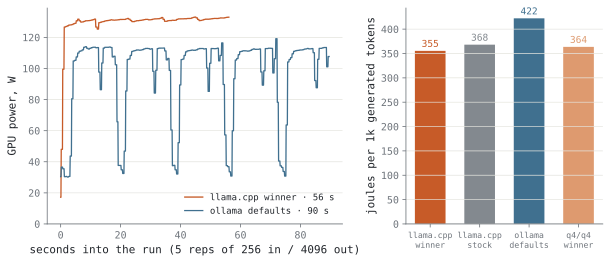{.light-content fig-alt="Power timeline plus bars of joules per 1000 generated tokens"}
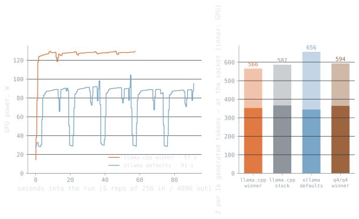{.dark-content fig-alt="Power timeline plus bars of joules per 1000 generated tokens"}

**Figure 8.** Power over a long generation, and the honest energy figure it integrates to — joules per 1000 generated tokens: the funnel winner 355 J, the max-context winner 364 J, llama.cpp stock 368 J, ollama defaults 422 J. Ranking by average watts would invert this.
<!-- llmbench:generated:end power -->

<!-- llmbench:commentary:begin power-notes -->
*TODO — commentary.*
<!-- llmbench:commentary:end power-notes -->

<!-- llmbench:generated:begin scoreboard hash=127e6fd08ab0 -->
## The tuning scoreboard

| Objective | ollama defaults | tuned llama.cpp | delta |
|---|---|---|---|
| Decode @ 512 tokens | 279.1 t/s | 371.3 t/s | +33.0 % |
| Decode @ 32k | 217.7 t/s | 268.8 t/s | +23.5 % |
| Time-to-first-token @ 512 | 301.3 ms | 38.5 ms | −87.2 % |
| Cold start | 4.29 s | 1.02 s | −3.27 s |
| Energy per 1000 tokens | 422 J | 355 J | −15.9 % |

Max context does not appear above because tuning does not move it here: every configuration measured reached 262 144 tokens, the largest this model declares.

Against llama.cpp's own stock settings rather than ollama's, the numeric knobs are worth +3.2 % decode — the categorical ones are where the tuning value is.
<!-- llmbench:generated:end scoreboard -->

<!-- llmbench:generated:begin translations hash=41f58f7eb298 -->
## What this means in human units

| Configuration | A 100-page PDF | Reads back at | Cost per 1M tokens |
|---|---|---|---|
| Out of the box (ollama defaults) | 7.8 s (5.5 s reading + 2.3 s writing) | 219 words/s, 54.8× a human reader | <span data-kwh-per-1m="0.11728">€0.0293</span> |
| Tuned for throughput | 6.6 s (4.7 s reading + 1.9 s writing) | 279 words/s, 69.8× a human reader | <span data-kwh-per-1m="0.09875">€0.0247</span> |
| Tuned for context | 7.3 s (4.8 s reading + 2.5 s writing) | 259 words/s, 64.8× a human reader | <span data-kwh-per-1m="0.101">€0.0253</span> |

<!-- llmbench:site-only:begin -->

Price it at your own tariff — the table above is computed at 0.25 €/kWh.

<div class="llmbench-price">
  <label for="llmbench-kwh">Electricity price</label>
  <input type="range" id="llmbench-kwh" min="0.10" max="0.50" step="0.01"
         value="0.25" aria-describedby="llmbench-kwh-out">
  <output id="llmbench-kwh-out">0.25 €/kWh</output>
</div>
<script>
(function () {
  var slider = document.getElementById("llmbench-kwh");
  var out = document.getElementById("llmbench-kwh-out");
  if (!slider || !out) return;
  function apply() {
    var price = parseFloat(slider.value);
    out.textContent = price.toFixed(2) + " \u20ac/kWh";
    document.querySelectorAll("[data-kwh-per-1m]").forEach(function (el) {
      var kwh = parseFloat(el.getAttribute("data-kwh-per-1m"));
      el.textContent = "\u20ac" + (kwh * price).toFixed(4);
    });
  }
  slider.addEventListener("input", apply);
  apply();
})();
</script>
<!-- llmbench:site-only:end -->

A "page" here is 650 tokens and a summary is 500; reading speed converts tokens to words at 0.75 and compares against 240 words per minute. Energy is GPU board power only — no power supply losses, no CPU, no fans.
<!-- llmbench:generated:end translations -->

<!-- llmbench:commentary:begin standout -->
## What stood out

*TODO — commentary.*
<!-- llmbench:commentary:end standout -->

<!-- llmbench:generated:begin repro hash=cce1062ac5df -->
## Reproducing this

Every number in this post was produced by the pipeline from committed results — none of it is typed by hand. To reproduce:

```
bench run --model qwen3.5-0.8b --hw-profile budget --runtime llama.cpp@b10068
bench run --model qwen3.5-0.8b --hw-profile budget --runtime ollama@v0.32.1
bench analyze --model qwen3.5-0.8b --hw-profile budget
bench stage qwen3.5-0.8b --hw-profile budget
```

Benchmark suite `v1`, results commit `8779924`. Prompts are cut to exact token counts with the model's own tokenizer and output length is forced, so every configuration processes and generates exactly the same number of tokens. Reported values are medians over repetitions with the inter-quartile spread; out-of-memory outcomes are recorded as data, not discarded.

[Open the full board for this model](board.html) — every figure, including the ones that did not make the post.
<!-- llmbench:generated:end repro -->
