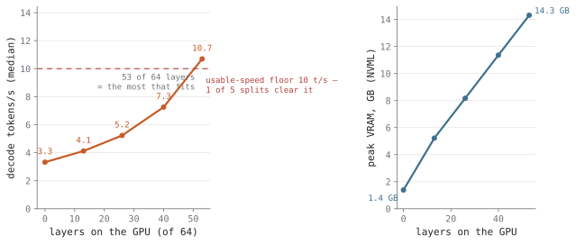
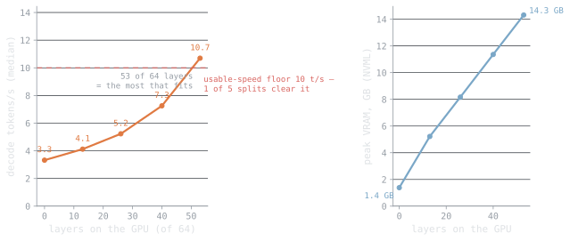
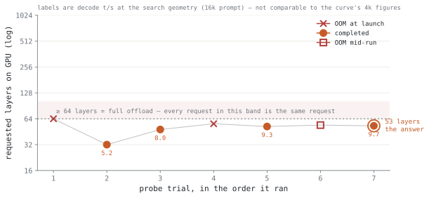
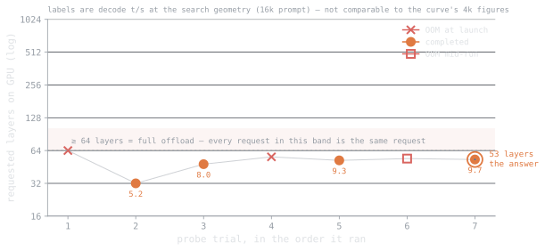
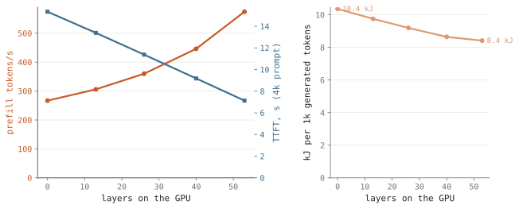
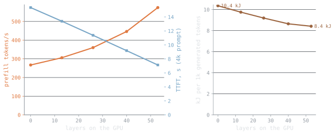
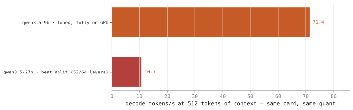
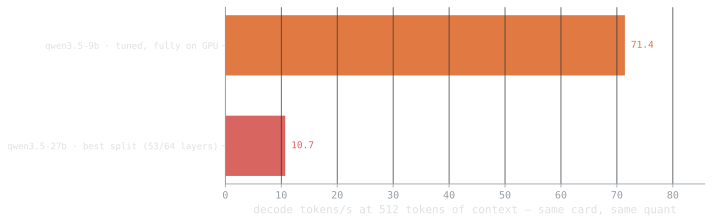

<!-- llmbench:generated:begin meta hash=c5cbd501d50d -->
| Provenance | |
|---|---|
| Model | `qwen3.5-27b`, unsloth GGUF Q4_K_M |
| Hardware profile | `budget` — 1x NVIDIA GeForce RTX 5060 Ti, 20 CPU cores |
| Runtimes | llama.cpp@b10068/gguf-Q4_K_M, ollama@v0.32.1/gguf-Q4_K_M |
| Benchmark version | `v1` |
| Results commit | `2722d64` |
<!-- llmbench:generated:end meta -->

<!-- llmbench:commentary:begin intro -->
Every other post in this series measures how fast a model runs. This one starts by measuring whether it runs at all. The weights are larger than the card before a single token of context, so a probe first has to find how many layers fit — and this time the answer clears the series' 10 t/s usability floor by a hair, which is a more interesting verdict than a page of out-of-memory errors: you can run it. The question the numbers answer is whether you should.
<!-- llmbench:commentary:end intro -->

<!-- llmbench:generated:begin verdict hash=bbc0d1b35502 -->
## How much of it fits

{.light-content fig-alt="Line chart: decode speed against number of layers on the GPU"}
{.dark-content fig-alt="Line chart: decode speed against number of layers on the GPU"}

**Figure 1.** Decode speed against how much of the model lives on the GPU. The best split puts 53 of 64 layers (82.8 %) on the card and decodes at — tokens/s — against a — tokens/s floor for calling a configuration usable.

{.light-content fig-alt="Scatter of the offload bisection search trials"}
{.dark-content fig-alt="Scatter of the offload bisection search trials"}

**Figure 2.** The search itself: 7 trials bisecting the offload level, 54 layers being the first that runs out of memory. It settles the question in minutes instead of a day of failed benchmark runs.
<!-- llmbench:generated:end verdict -->

<!-- llmbench:commentary:begin verdict-notes -->
*TODO — commentary.*
<!-- llmbench:commentary:end verdict-notes -->

<!-- llmbench:generated:begin cost hash=291a53df424e -->
## What partial offload costs

{.light-content fig-alt="Panels: prefill, latency and energy against offload level"}
{.dark-content fig-alt="Panels: prefill, latency and energy against offload level"}

**Figure 3.** What less offload costs: prompt processing, first-token latency and energy per 1000 tokens. Energy per token *rises* as you move layers to the CPU — 19 609 J at the best split against 57 249 J with the model on the CPU — because the run takes so much longer.
<!-- llmbench:generated:end cost -->

<!-- llmbench:commentary:begin cost-notes -->
*TODO — commentary.*
<!-- llmbench:commentary:end cost-notes -->

<!-- llmbench:generated:begin instead hash=853154ff0752 -->
## What to run instead

{.light-content fig-alt="Bar chart comparing decode speed with the next smaller model"}
{.dark-content fig-alt="Bar chart comparing decode speed with the next smaller model"}

**Figure 4.** The same card running the rung below. qwen3.5-9b decodes 71.4 tokens/s where this model manages 10.70 — 6.7× faster, for 5.5× less energy per token.
<!-- llmbench:generated:end instead -->

<!-- llmbench:commentary:begin instead-notes -->
*TODO — commentary.*
<!-- llmbench:commentary:end instead-notes -->

<!-- llmbench:generated:begin translations hash=c759adc9a675 -->
## What this means in human units

| Configuration | A 100-page PDF | Reads back at | Cost per 1M tokens |
|---|---|---|---|
| Out of the box (ollama defaults) | only 24 pages fit | 9 words/s, 2.3× a human reader | <span data-kwh-per-1m="4.21678">€1.0542</span> |
| Tuned for throughput | only 18 pages fit | 8 words/s, 2.1× a human reader | <span data-kwh-per-1m="4.54019">€1.1350</span> |
| Tuned for context | only 11 pages fit | 8 words/s, 2.1× a human reader | <span data-kwh-per-1m="4.62547">€1.1564</span> |

<!-- llmbench:site-only:begin -->

Price it at your own tariff — the table above is computed at 0.25 €/kWh.

<div class="llmbench-price">
  <label for="llmbench-kwh">Electricity price</label>
  <input type="range" id="llmbench-kwh" min="0.10" max="0.50" step="0.01"
         value="0.25" aria-describedby="llmbench-kwh-out">
  <output id="llmbench-kwh-out">0.25 €/kWh</output>
</div>
<script>
(function () {
  var slider = document.getElementById("llmbench-kwh");
  var out = document.getElementById("llmbench-kwh-out");
  if (!slider || !out) return;
  function apply() {
    var price = parseFloat(slider.value);
    out.textContent = price.toFixed(2) + " \u20ac/kWh";
    document.querySelectorAll("[data-kwh-per-1m]").forEach(function (el) {
      var kwh = parseFloat(el.getAttribute("data-kwh-per-1m"));
      el.textContent = "\u20ac" + (kwh * price).toFixed(4);
    });
  }
  slider.addEventListener("input", apply);
  apply();
})();
</script>
<!-- llmbench:site-only:end -->

A "page" here is 650 tokens and a summary is 500; reading speed converts tokens to words at 0.75 and compares against 240 words per minute. Energy is GPU board power only — no power supply losses, no CPU, no fans.
<!-- llmbench:generated:end translations -->

<!-- llmbench:commentary:begin standout -->
## What stood out

*TODO — commentary.*
<!-- llmbench:commentary:end standout -->

<!-- llmbench:generated:begin repro hash=feab83cad122 -->
## Reproducing this

Every number in this post was produced by the pipeline from committed results — none of it is typed by hand. To reproduce:

```
bench run --model qwen3.5-27b --hw-profile budget --runtime llama.cpp@b10068
bench run --model qwen3.5-27b --hw-profile budget --runtime ollama@v0.32.1
bench analyze --model qwen3.5-27b --hw-profile budget
bench stage qwen3.5-27b --hw-profile budget
```

Benchmark suite `v1`, results commit `2722d64`. Prompts are cut to exact token counts with the model's own tokenizer and output length is forced, so every configuration processes and generates exactly the same number of tokens. Reported values are medians over repetitions with the inter-quartile spread; out-of-memory outcomes are recorded as data, not discarded.

[Open the full board for this model](board.html) — every figure, including the ones that did not make the post.
<!-- llmbench:generated:end repro -->
