<!-- llmbench:generated:begin meta hash=2ab9d015bcdc -->
| Provenance | |
|---|---|
| Model | `qwen3.5-2b`, unsloth GGUF Q4_K_M |
| Hardware profile | `budget` — 1x NVIDIA GeForce RTX 5060 Ti, 20 CPU cores |
| Runtimes | llama.cpp@b10068/gguf-Q4_K_M, ollama@v0.32.1/gguf-Q4_K_M |
| Benchmark version | `v1` |
| Results commit | `2722d64` |
<!-- llmbench:generated:end meta -->

<!-- llmbench:commentary:begin intro -->
Second rung, and the first one with a previous rung to compare against. Two things travel across the pair: the cost of the serving wrapper, and whether tuning gets more valuable as models get bigger.
<!-- llmbench:commentary:end intro -->

<!-- llmbench:generated:begin outofbox hash=e6ddc1815955 -->
## Out of the box

Decode, out of the box
:   190.2 tokens/s at 512 tokens of context

Decode, tuned
:   230.9 tokens/s

Decode at 32k
:   160.8 out of the box, 189.1 tuned

Largest usable context
:   262 144 tokens

Cold start
:   4.33 s out of the box, 1.02 s tuned


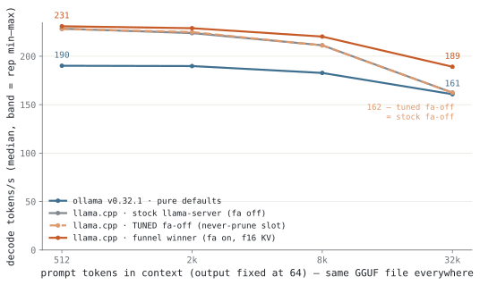{.light-content fig-alt="Line chart: decode tokens per second against context depth"}
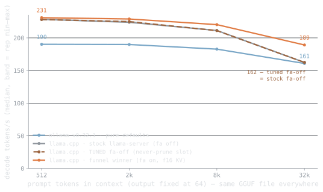{.dark-content fig-alt="Line chart: decode tokens per second against context depth"}

**Figure 1.** Decode speed against context depth — the same GGUF file in every run. Tuned llama.cpp holds 230.9 tokens/s at 512 tokens of context and 189.1 at 32k; ollama's defaults give 190.2 and 160.8, a +17.3 % gap at depth.

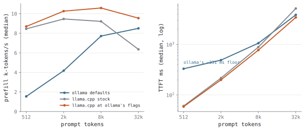{.light-content fig-alt="Two panels: prefill throughput and time-to-first-token vs depth"}
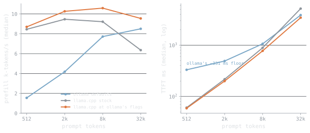{.dark-content fig-alt="Two panels: prefill throughput and time-to-first-token vs depth"}

**Figure 2.** Prompt processing and time-to-first-token. Tuned llama.cpp prefills at 9.5k tokens/s at 32k and answers a 512-token prompt in 58.9 ms, against ollama's 331.0 ms floor.
<!-- llmbench:generated:end outofbox -->

<!-- llmbench:commentary:begin outofbox-notes -->
*TODO — commentary.*
<!-- llmbench:commentary:end outofbox-notes -->

<!-- llmbench:generated:begin wrapper hash=e5b854ab74ad -->
## In depth — the wrapper tax

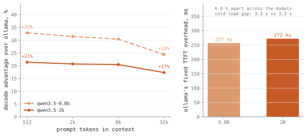{.light-content fig-alt="Line chart: ollama overhead in percent against context depth, per model"}
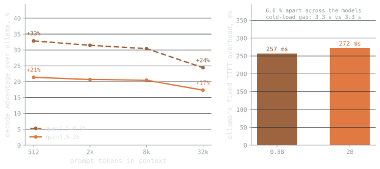{.dark-content fig-alt="Line chart: ollama overhead in percent against context depth, per model"}

**Figure 3.** The wrapper tax across the ladder, measured at each depth: qwen3.5-2b +21.4 %, qwen3.5-0.8b +32.9 % at 512 tokens. The overhead is a fixed cost, so it shrinks in percentage terms as the model gets slower.

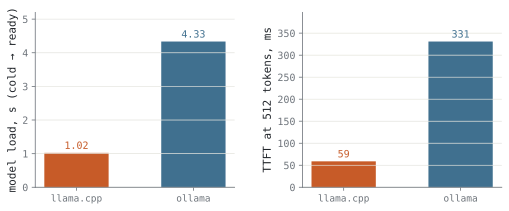{.light-content fig-alt="Bar chart: model load time and first-token latency per runtime"}
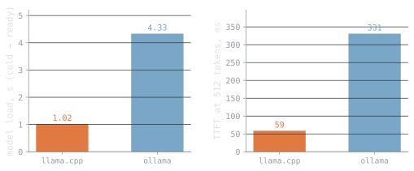{.dark-content fig-alt="Bar chart: model load time and first-token latency per runtime"}

**Figure 4.** Cold start and the fixed price of the wrapper. llama.cpp is serving 1.02 s after launch, ollama 4.33 s — a 3.31 s gap, plus 272.1 ms on every first token.
<!-- llmbench:generated:end wrapper -->

<!-- llmbench:commentary:begin wrapper-notes -->
*TODO — commentary.*
<!-- llmbench:commentary:end wrapper-notes -->

<!-- llmbench:generated:begin context hash=78144b9bd4df -->
## In depth — the knobs that change what you can run

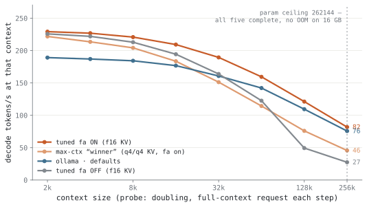{.light-content fig-alt="Line chart: decode speed along each configuration's context ladder"}
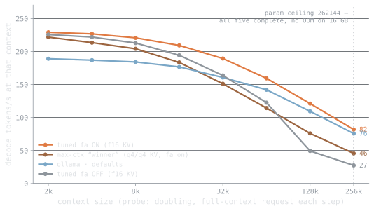{.dark-content fig-alt="Line chart: decode speed along each configuration's context ladder"}

**Figure 5.** Decode speed along each configuration's context ladder, out to the point where it stops. Speed at the limit is what decides whether a long context is usable rather than merely loadable: flash-attn on manages 81.8 tokens/s at 262 144 tokens; ollama defaults manages 75.7 tokens/s at 262 144 tokens; the max-context winner manages 45.6 tokens/s at 262 144 tokens; flash-attn off manages 27.5 tokens/s at 262 144 tokens.

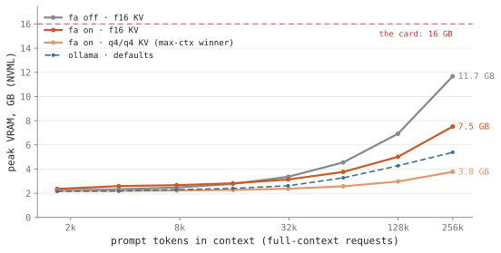{.light-content fig-alt="Line chart: peak VRAM against context depth per configuration"}
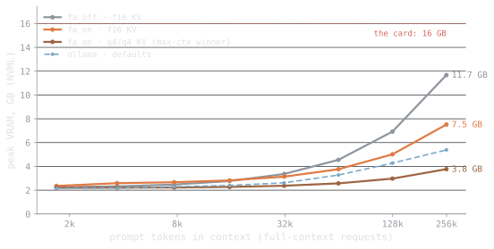{.dark-content fig-alt="Line chart: peak VRAM against context depth per configuration"}

**Figure 6.** Peak VRAM as context grows, and where each configuration stops: flash-attn off 11.68 GB, flash-attn on 7.52 GB, the max-context winner 3.77 GB, ollama defaults 5.38 GB at its deepest completed request.
<!-- llmbench:generated:end context -->

<!-- llmbench:commentary:begin context-notes -->
*TODO — commentary.*
<!-- llmbench:commentary:end context-notes -->

<!-- llmbench:generated:begin flat hash=87a0b65009b2 -->
## In depth — the knobs that don't matter

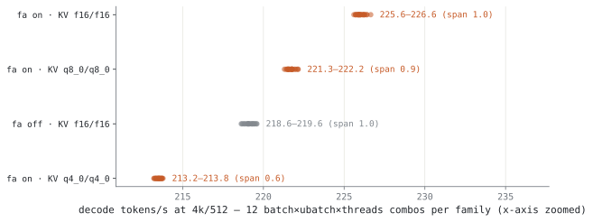{.light-content fig-alt="Strip plot: decode speed of every refine configuration, by family"}
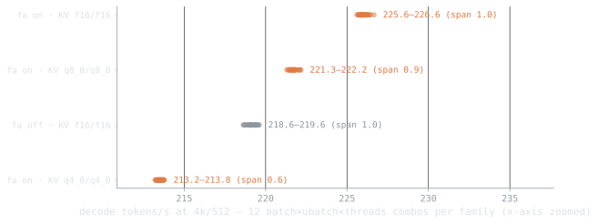{.dark-content fig-alt="Strip plot: decode speed of every refine configuration, by family"}

**Figure 7.** Every batch, micro-batch and thread combination the refine stage measured (96 configurations). Within a family the whole spread is 1.04 tokens/s; between families it is 13.4 — the flat knobs are flat, and the categorical ones are not.
<!-- llmbench:generated:end flat -->

<!-- llmbench:commentary:begin flat-notes -->
*TODO — commentary.*
<!-- llmbench:commentary:end flat-notes -->

<!-- llmbench:generated:begin power hash=c159292c2844 -->
## Power and energy

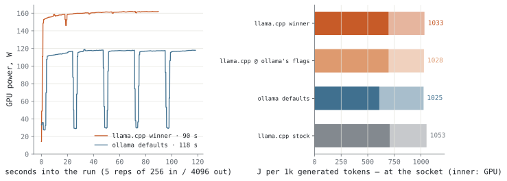{.light-content fig-alt="Power timeline plus bars of joules per 1000 generated tokens"}
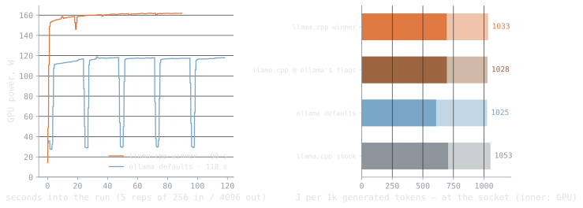{.dark-content fig-alt="Power timeline plus bars of joules per 1000 generated tokens"}

**Figure 8.** Power over a long generation, and the honest energy figure it integrates to — joules per 1000 generated tokens: ollama defaults 608 J, the funnel winner 695 J, llama.cpp at ollama's own flags 696 J, llama.cpp stock 706 J. Ranking by average watts would invert this. These are card joules; the CPU package adds 128–172 J on top, so ollama defaults really costs 780 J per 1000 tokens. At the wall socket the whole box costs 1 025 J per 1000 tokens for ollama defaults — 245 J more than the counters see, which is the PSU, the RAM, the fans and the drives.
<!-- llmbench:generated:end power -->

<!-- llmbench:commentary:begin power-notes -->
*TODO — commentary.*
<!-- llmbench:commentary:end power-notes -->

<!-- llmbench:generated:begin scoreboard hash=398daa52428f -->
## The tuning scoreboard

| Objective | ollama defaults | tuned llama.cpp | delta |
|---|---|---|---|
| Decode @ 512 tokens | 190.2 t/s | 230.9 t/s | +21.4 % |
| Decode @ 32k | 160.8 t/s | 189.1 t/s | +17.6 % |
| Time-to-first-token @ 512 | 331.0 ms | 58.9 ms | −82.2 % |
| Cold start | 4.33 s | 1.02 s | −3.31 s |
| Energy per 1000 tokens (wall) | 1 025 J | 1 033 J | +0.8 % |

Max context does not appear above because tuning does not move it here: every configuration measured reached 262 144 tokens, the largest this model declares.

Against llama.cpp's own stock settings rather than ollama's, the numeric knobs are worth +2.0 % decode — the categorical ones are where the tuning value is.
<!-- llmbench:generated:end scoreboard -->

<!-- llmbench:generated:begin translations hash=1ee1fe01b3c1 -->
## What this means in human units

| Configuration | A 100-page PDF | Reads back at | Cost per 1M tokens |
|---|---|---|---|
| Out of the box (ollama defaults) | 10.8 s (7.6 s reading + 3.1 s writing) | 149 words/s, 37.3× a human reader | <span data-kwh-per-1m="0.28467">€0.0712</span> |
| Tuned for throughput | 9.4 s (6.8 s reading + 2.6 s writing) | 173 words/s, 43.3× a human reader | <span data-kwh-per-1m="0.28697">€0.0717</span> |
| Tuned for context | 10.2 s (6.9 s reading + 3.3 s writing) | 166 words/s, 41.5× a human reader | <span data-kwh-per-1m="0.29289">€0.0732</span> |

<!-- llmbench:site-only:begin -->

Price it at your own tariff — the table above is computed at 0.25 €/kWh.

<div class="llmbench-price">
  <label for="llmbench-kwh">Electricity price</label>
  <input type="range" id="llmbench-kwh" min="0.10" max="0.50" step="0.01"
         value="0.25" aria-describedby="llmbench-kwh-out">
  <output id="llmbench-kwh-out">0.25 €/kWh</output>
</div>
<script>
(function () {
  var slider = document.getElementById("llmbench-kwh");
  var out = document.getElementById("llmbench-kwh-out");
  if (!slider || !out) return;
  function apply() {
    var price = parseFloat(slider.value);
    out.textContent = price.toFixed(2) + " \u20ac/kWh";
    document.querySelectorAll("[data-kwh-per-1m]").forEach(function (el) {
      var kwh = parseFloat(el.getAttribute("data-kwh-per-1m"));
      el.textContent = "\u20ac" + (kwh * price).toFixed(4);
    });
  }
  slider.addEventListener("input", apply);
  apply();
})();
</script>
<!-- llmbench:site-only:end -->

A "page" here is 650 tokens and a summary is 500; reading speed converts tokens to words at 0.75 and compares against 240 words per minute. Energy is GPU board power only — no power supply losses, no CPU, no fans.
<!-- llmbench:generated:end translations -->

<!-- llmbench:commentary:begin standout -->
## What stood out

*TODO — commentary.*
<!-- llmbench:commentary:end standout -->

<!-- llmbench:generated:begin repro hash=2da27ec7d27c -->
## Reproducing this

Every number in this post was produced by the pipeline from committed results — none of it is typed by hand. To reproduce:

```
bench run --model qwen3.5-2b --hw-profile budget --runtime llama.cpp@b10068
bench run --model qwen3.5-2b --hw-profile budget --runtime ollama@v0.32.1
bench analyze --model qwen3.5-2b --hw-profile budget
bench stage qwen3.5-2b --hw-profile budget
```

Benchmark suite `v1`, results commit `2722d64`. Prompts are cut to exact token counts with the model's own tokenizer and output length is forced, so every configuration processes and generates exactly the same number of tokens. Reported values are medians over repetitions with the inter-quartile spread; out-of-memory outcomes are recorded as data, not discarded.

[Open the full board for this model](board.html) — every figure, including the ones that did not make the post.
<!-- llmbench:generated:end repro -->
