<!-- llmbench:generated:begin meta hash=ac171e987f73 -->
| Provenance | |
|---|---|
| Model | `qwen3.5-35b-a3b`, unsloth GGUF Q4_K_M |
| Hardware profile | `budget` — 1x NVIDIA GeForce RTX 5060 Ti, 20 CPU cores |
| Runtimes | llama.cpp@b10068/gguf-Q4_K_M, ollama@v0.32.1/gguf-Q4_K_M |
| Benchmark version | `v1` |
| Results commit | `2722d64` |
<!-- llmbench:generated:end meta -->

<!-- llmbench:commentary:begin intro -->
The sixth rung breaks the ladder's own pattern twice. It does not fit the card — 20 GiB of weights against 16 GB of VRAM — and yet it decodes within reach of the 9B that does, because only about 3B of its 35B parameters are active for any given token. Getting that speed required throwing away this series' first attempt at measuring it, and the reason is the most useful thing in the post: for a mixture of experts, the question is not how much of the model lives on the GPU but which parts.
<!-- llmbench:commentary:end intro -->

<!-- llmbench:generated:begin outofbox hash=1049361db4a6 -->
## Out of the box

Decode, out of the box
:   56.9 tokens/s at 512 tokens of context

Decode, tuned
:   63.4 tokens/s

Decode at 32k
:   51.0 out of the box, 53.1 tuned

Largest usable context
:   131 072 tokens

Cold start
:   8.44 s out of the box, 2.41 s tuned


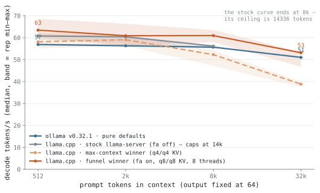{.light-content fig-alt="Line chart: decode tokens per second against context depth"}
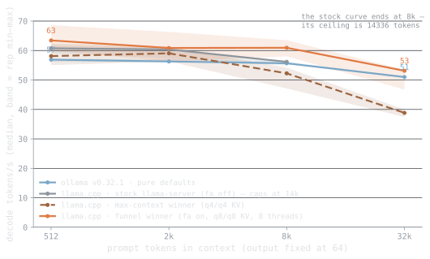{.dark-content fig-alt="Line chart: decode tokens per second against context depth"}

**Figure 1.** Decode speed against context depth — the same GGUF file in every run. Tuned llama.cpp holds 63.4 tokens/s at 512 tokens of context and 53.1 at 32k; ollama's defaults give 56.9 and 51.0, a +7.4 % gap at depth.

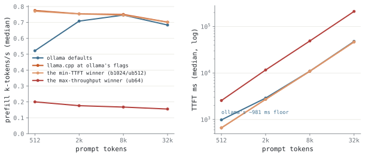{.light-content fig-alt="Two panels: prefill throughput and time-to-first-token vs depth"}
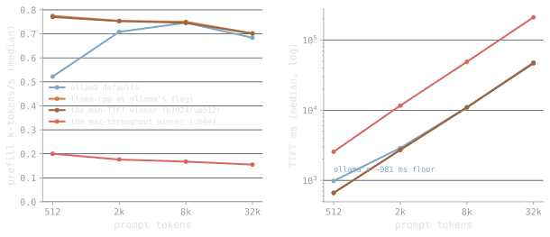{.dark-content fig-alt="Two panels: prefill throughput and time-to-first-token vs depth"}

**Figure 2.** Prompt processing and time-to-first-token. Tuned llama.cpp prefills at 0.7k tokens/s at 32k and answers a 512-token prompt in 660.6 ms, against ollama's 981.2 ms floor.
<!-- llmbench:generated:end outofbox -->

<!-- llmbench:commentary:begin outofbox-notes -->
*TODO — commentary.*
<!-- llmbench:commentary:end outofbox-notes -->

<!-- llmbench:generated:begin placement hash=7b7e53b327a8 -->
## In depth — which tensors leave the GPU

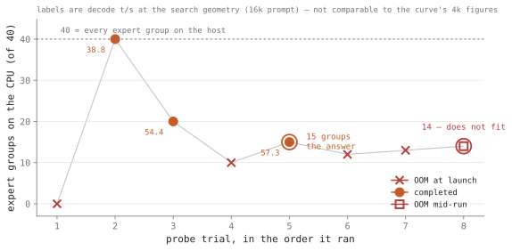{.light-content fig-alt="Scatter of the expert-placement search trials, with the answer and the out-of-memory boundary ringed"}
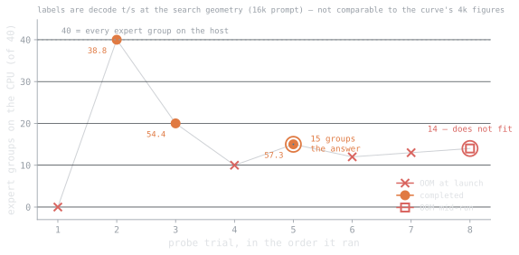{.dark-content fig-alt="Scatter of the expert-placement search trials, with the answer and the out-of-memory boundary ringed"}

**Figure 3.** The placement search: 8 trials looking for the fewest expert groups that have to sit on the CPU. The answer is 15 of 40 — 14 runs out of memory — which leaves 25 expert groups and every attention block on the card.

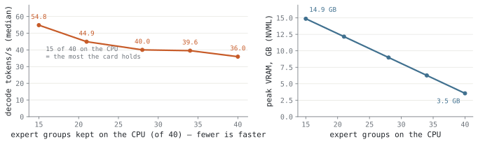{.light-content fig-alt="Two panels: decode speed and peak VRAM against the number of expert groups kept on the CPU"}
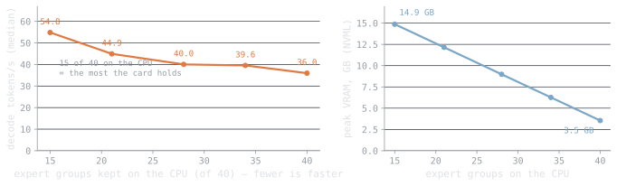{.dark-content fig-alt="Two panels: decode speed and peak VRAM against the number of expert groups kept on the CPU"}

**Figure 4.** What each expert group costs. Keeping 15 groups on the CPU decodes 54.8 tokens/s at 14.9 GB of VRAM; moving all 40 to the host costs 36.0 tokens/s.

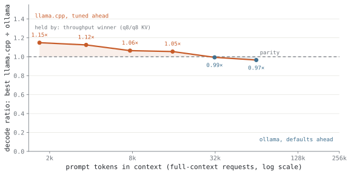{.light-content fig-alt="Line chart: decode ratio of tuned llama.cpp to ollama against context depth, crossing parity"}
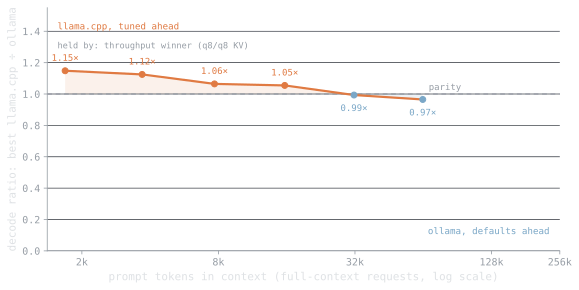{.dark-content fig-alt="Line chart: decode ratio of tuned llama.cpp to ollama against context depth, crossing parity"}

**Figure 5.** Where the lead changes hands. Tuned llama.cpp is 1.05–1.15× faster up to 15k of context, using whichever configuration can serve each depth. From 31k it leads outright — 50.5 against 50.2 tokens/s. ollama re-fits expert placement for every context size, so its memory footprint moves by 0.09 GB across the whole ladder while ours moves 0.83 GB and runs into the card.
<!-- llmbench:generated:end placement -->

<!-- llmbench:commentary:begin placement-notes -->
*TODO — commentary.*
<!-- llmbench:commentary:end placement-notes -->

<!-- llmbench:generated:begin wrapper hash=78a9bd092725 -->
## In depth — the wrapper tax

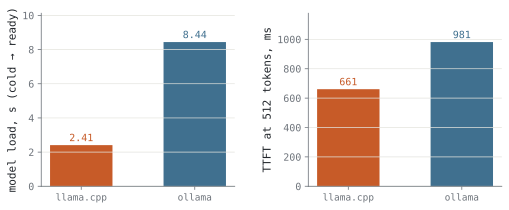{.light-content fig-alt="Bar chart: model load time and first-token latency per runtime"}
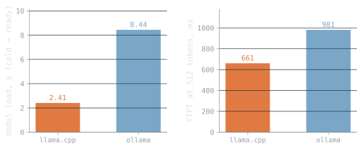{.dark-content fig-alt="Bar chart: model load time and first-token latency per runtime"}

**Figure 6.** Cold start and the fixed price of the wrapper. llama.cpp is serving 2.41 s after launch, ollama 8.44 s — a 6.03 s gap, plus 320.6 ms on every first token.
<!-- llmbench:generated:end wrapper -->

<!-- llmbench:commentary:begin wrapper-notes -->
*TODO — commentary.*
<!-- llmbench:commentary:end wrapper-notes -->

<!-- llmbench:generated:begin context hash=050294f0f0a0 -->
## In depth — the knobs that change what you can run

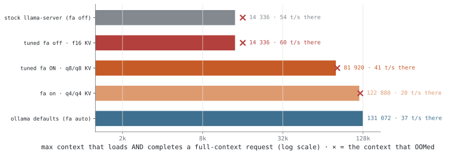{.light-content fig-alt="Horizontal log-scale bars: maximum context per configuration"}
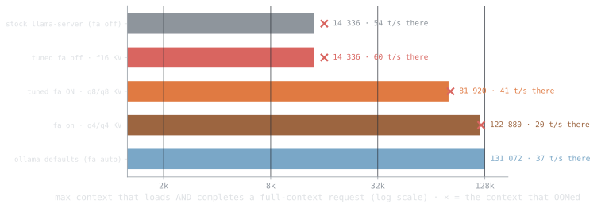{.dark-content fig-alt="Horizontal log-scale bars: maximum context per configuration"}

**Figure 7.** Maximum context that loads AND completes a full-context request, per configuration (log scale). The spread on one card is 14 336 to 131 072 tokens — a factor of 9.1× — decided by tuning alone.

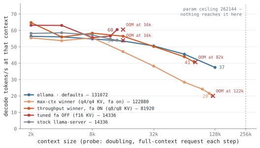{.light-content fig-alt="Line chart: decode speed along each configuration's context ladder"}
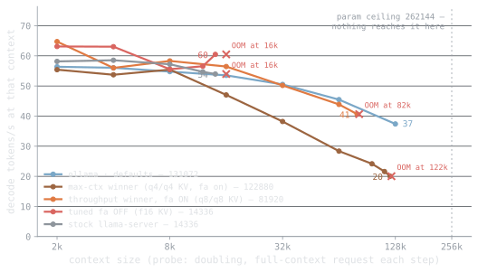{.dark-content fig-alt="Line chart: decode speed along each configuration's context ladder"}

**Figure 8.** Decode speed along each configuration's context ladder, out to the point where it stops. Speed at the limit is what decides whether a long context is usable rather than merely loadable: flash-attn off manages 60.5 tokens/s at 14 336 tokens; llama.cpp stock manages 54.0 tokens/s at 14 336 tokens; flash-attn on manages 40.6 tokens/s at 81 920 tokens; ollama defaults manages 37.4 tokens/s at 131 072 tokens; the max-context winner manages 20.0 tokens/s at 122 880 tokens.

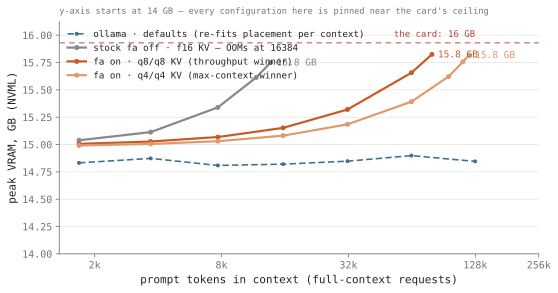{.light-content fig-alt="Line chart: peak VRAM against context depth per configuration"}
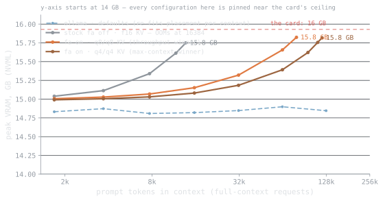{.dark-content fig-alt="Line chart: peak VRAM against context depth per configuration"}

**Figure 9.** Peak VRAM as context grows, and where each configuration stops: ollama defaults 14.85 GB, llama.cpp stock 15.75 GB, flash-attn on 15.82 GB, the max-context winner 15.82 GB at its deepest completed request.
<!-- llmbench:generated:end context -->

<!-- llmbench:commentary:begin context-notes -->
*TODO — commentary.*
<!-- llmbench:commentary:end context-notes -->

<!-- llmbench:generated:begin flat hash=280f4690feff -->
## In depth — the knobs that don't matter

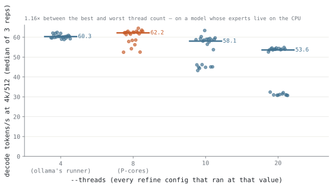{.light-content fig-alt="Strip plot: decode speed of every refine configuration, grouped by thread count"}
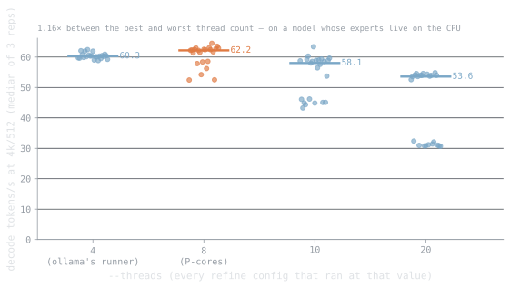{.dark-content fig-alt="Strip plot: decode speed of every refine configuration, grouped by thread count"}

**Figure 10.** Thread count, on a model whose experts live in system memory. 8 threads — the CPU's performance-core count — decodes a median 62.2 tokens/s against 53.6 at 20: 1.16× from one knob the earlier posts in this series correctly called flat. It is flat only while the model fits on the GPU.

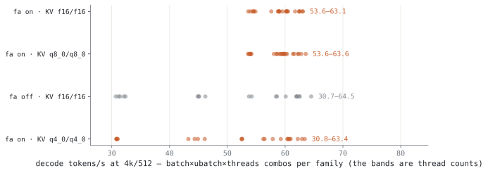{.light-content fig-alt="Strip plot: decode speed of every refine configuration, by family"}
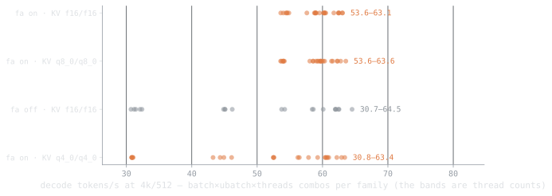{.dark-content fig-alt="Strip plot: decode speed of every refine configuration, by family"}

**Figure 11.** Every batch, micro-batch and thread combination the refine stage measured (92 configurations). Within a family the whole spread is 33.82 tokens/s; between families it is 33.8 — the flat knobs are flat, and the categorical ones are not.
<!-- llmbench:generated:end flat -->

<!-- llmbench:commentary:begin flat-notes -->
*TODO — commentary.*
<!-- llmbench:commentary:end flat-notes -->

<!-- llmbench:generated:begin power hash=d7471eaec7a6 -->
## Power and energy

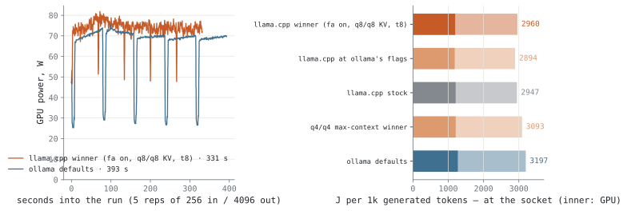{.light-content fig-alt="Power timeline plus bars of joules per 1000 generated tokens"}
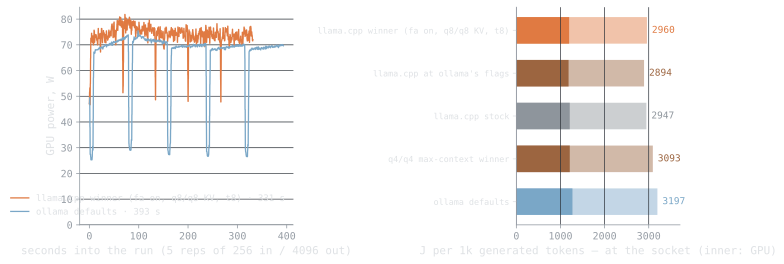{.dark-content fig-alt="Power timeline plus bars of joules per 1000 generated tokens"}

**Figure 12.** Power over a long generation, and the honest energy figure it integrates to — joules per 1000 generated tokens: llama.cpp at ollama's own flags 1 184 J, the funnel winner 1 196 J, llama.cpp stock 1 210 J, the max-context winner 1 211 J, ollama defaults 1 271 J. Ranking by average watts would invert this. These are card joules; the CPU package adds 947–1 082 J on top, so the max-context winner really costs 2 293 J per 1000 tokens. At the wall socket the whole box costs 2 894 J per 1000 tokens for llama.cpp at ollama's own flags — 763 J more than the counters see, which is the PSU, the RAM, the fans and the drives.

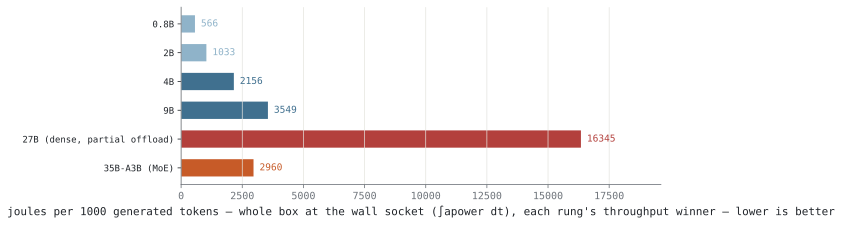{.light-content fig-alt="Horizontal bars: joules per 1000 generated tokens for each model in the family"}
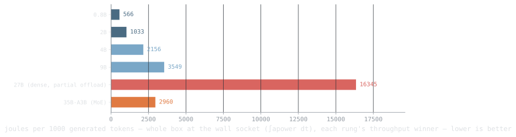{.dark-content fig-alt="Horizontal bars: joules per 1000 generated tokens for each model in the family"}

**Figure 13.** GPU energy per 1000 generated tokens, each model at its fastest configuration: 0.8B 353 J, 2B 695 J, 4B 1 461 J, 9B 2 420 J, 27B (dense, partial offload) 6 469 J. This one costs 1 196 J —  — because only a fraction of its parameters are active per token, so it draws 73.9 W where the dense rungs draw well over 100. Because this model alone runs part of itself on the host, the card's joules are not the run's joules: the CPU package adds 947 J on top of the 1 184 J the card reports for llama.cpp at ollama's own flags, so 44 % of the energy never appears in a graphics-card comparison. And the sum is not the end of it — a meter at the socket reads 2 894 J for the same work, the rest being PSU losses, RAM, fans and drives.
<!-- llmbench:generated:end power -->

<!-- llmbench:commentary:begin power-notes -->
*TODO — commentary.*
<!-- llmbench:commentary:end power-notes -->

<!-- llmbench:generated:begin scoreboard hash=571c91776627 -->
## The tuning scoreboard

| Objective | ollama defaults | tuned llama.cpp | delta |
|---|---|---|---|
| Decode @ 512 tokens | 56.9 t/s | 63.4 t/s | +11.4 % |
| Decode @ 32k | 51.0 t/s | 53.1 t/s | +4.1 % |
| Time-to-first-token @ 512 | 981.2 ms | 660.6 ms | −32.7 % |
| Cold start | 8.44 s | 2.41 s | −6.03 s |
| Energy per 1000 tokens (wall) | 3 197 J | 2 960 J | −7.4 % |

Max context is the objective the table cannot hold, because it is not an ollama-versus-tuned question: across tuned configurations it ranges from 14 336 to 131 072 tokens — a spread of 9.1× on one card.

Against llama.cpp's own stock settings rather than ollama's, the numeric knobs are worth +4.8 % decode — the categorical ones are where the tuning value is.
<!-- llmbench:generated:end scoreboard -->

<!-- llmbench:generated:begin translations hash=02c398c0e364 -->
## What this means in human units

| Configuration | A 100-page PDF | Reads back at | Cost per 1M tokens |
|---|---|---|---|
| Out of the box (ollama defaults) | 104.9 s (95.1 s reading + 9.8 s writing) | 43 words/s, 10.8× a human reader | <span data-kwh-per-1m="0.88803">€0.2220</span> |
| Tuned for throughput | 428.5 s (419.1 s reading + 9.4 s writing) | 48 words/s, 12.0× a human reader | <span data-kwh-per-1m="0.82211">€0.2055</span> |
| Tuned for context | 105.6 s (92.7 s reading + 12.9 s writing) | 44 words/s, 11.1× a human reader | <span data-kwh-per-1m="0.85917">€0.2148</span> |

<!-- llmbench:site-only:begin -->

Price it at your own tariff — the table above is computed at 0.25 €/kWh.

<div class="llmbench-price">
  <label for="llmbench-kwh">Electricity price</label>
  <input type="range" id="llmbench-kwh" min="0.10" max="0.50" step="0.01"
         value="0.25" aria-describedby="llmbench-kwh-out">
  <output id="llmbench-kwh-out">0.25 €/kWh</output>
</div>
<script>
(function () {
  var slider = document.getElementById("llmbench-kwh");
  var out = document.getElementById("llmbench-kwh-out");
  if (!slider || !out) return;
  function apply() {
    var price = parseFloat(slider.value);
    out.textContent = price.toFixed(2) + " \u20ac/kWh";
    document.querySelectorAll("[data-kwh-per-1m]").forEach(function (el) {
      var kwh = parseFloat(el.getAttribute("data-kwh-per-1m"));
      el.textContent = "\u20ac" + (kwh * price).toFixed(4);
    });
  }
  slider.addEventListener("input", apply);
  apply();
})();
</script>
<!-- llmbench:site-only:end -->

A "page" here is 650 tokens and a summary is 500; reading speed converts tokens to words at 0.75 and compares against 240 words per minute. Energy is GPU board power only — no power supply losses, no CPU, no fans.
<!-- llmbench:generated:end translations -->

<!-- llmbench:commentary:begin standout -->
## What stood out

*TODO — commentary.*
<!-- llmbench:commentary:end standout -->

<!-- llmbench:generated:begin repro hash=8524d5428687 -->
## Reproducing this

Every number in this post was produced by the pipeline from committed results — none of it is typed by hand. To reproduce:

```
bench run --model qwen3.5-35b-a3b --hw-profile budget --runtime llama.cpp@b10068
bench run --model qwen3.5-35b-a3b --hw-profile budget --runtime ollama@v0.32.1
bench analyze --model qwen3.5-35b-a3b --hw-profile budget
bench stage qwen3.5-35b-a3b --hw-profile budget
```

Benchmark suite `v1`, results commit `2722d64`. Prompts are cut to exact token counts with the model's own tokenizer and output length is forced, so every configuration processes and generates exactly the same number of tokens. Reported values are medians over repetitions with the inter-quartile spread; out-of-memory outcomes are recorded as data, not discarded.

[Open the full board for this model](board.html) — every figure, including the ones that did not make the post.
<!-- llmbench:generated:end repro -->
