<!-- llmbench:generated:begin meta hash=dd25d513fd7e -->
| Provenance | |
|---|---|
| Model | `qwen3.5-9b`, unsloth GGUF Q4_K_M |
| Hardware profile | `budget` — 1x NVIDIA GeForce RTX 5060 Ti, 20 CPU cores |
| Runtimes | llama.cpp@b10068/gguf-Q4_K_M, ollama@v0.32.1/gguf-Q4_K_M |
| Benchmark version | `v1` |
| Results commit | `2722d64` |
<!-- llmbench:generated:end meta -->

<!-- llmbench:commentary:begin intro -->
The fourth rung is the biggest Qwen3.5 that fits a 16 GB card in one piece, and it is where the sweep's design earns itself: tuning for throughput and tuning for context pull in opposite directions, and a single-winner benchmark would have hidden it.
<!-- llmbench:commentary:end intro -->

<!-- llmbench:generated:begin outofbox hash=2ae015addf4d -->
## Out of the box

Decode, out of the box
:   66.8 tokens/s at 512 tokens of context

Decode, tuned
:   71.4 tokens/s

Decode at 32k
:   57.1 out of the box, 60.4 tuned

Largest usable context
:   262 144 tokens

Cold start
:   4.80 s out of the box, 1.31 s tuned


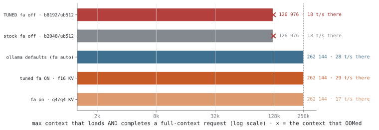{.light-content fig-alt="Horizontal log-scale bars: maximum context per configuration"}
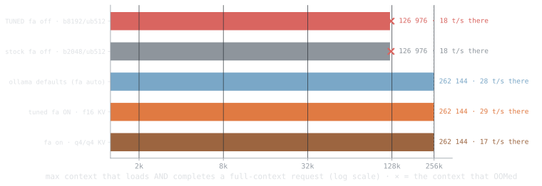{.dark-content fig-alt="Horizontal log-scale bars: maximum context per configuration"}

**Figure 1.** Maximum context that loads AND completes a full-context request, per configuration (log scale). The spread on one card is 126 976 to 262 144 tokens — a factor of 2.1× — decided by tuning alone.

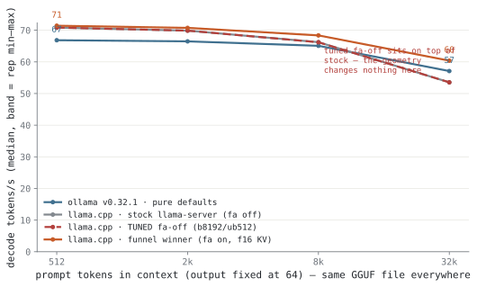{.light-content fig-alt="Line chart: decode tokens per second against context depth"}
{.dark-content fig-alt="Line chart: decode tokens per second against context depth"}

**Figure 2.** Decode speed against context depth — the same GGUF file in every run. Tuned llama.cpp holds 71.4 tokens/s at 512 tokens of context and 60.4 at 32k; ollama's defaults give 66.8 and 57.1, a +5.7 % gap at depth.

{.light-content fig-alt="Two panels: prefill throughput and time-to-first-token vs depth"}
{.dark-content fig-alt="Two panels: prefill throughput and time-to-first-token vs depth"}

**Figure 3.** Prompt processing and time-to-first-token. Tuned llama.cpp prefills at 2.7k tokens/s at 32k and answers a 512-token prompt in 190.0 ms, against ollama's 452.9 ms floor.
<!-- llmbench:generated:end outofbox -->

<!-- llmbench:commentary:begin outofbox-notes -->
*TODO — commentary.*
<!-- llmbench:commentary:end outofbox-notes -->

<!-- llmbench:generated:begin wrapper hash=bffdb0a72c35 -->
## In depth — the wrapper tax

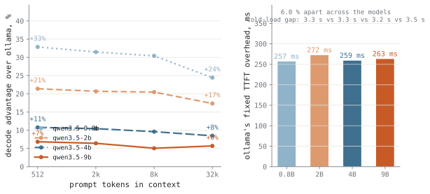{.light-content fig-alt="Line chart: ollama overhead in percent against context depth, per model"}
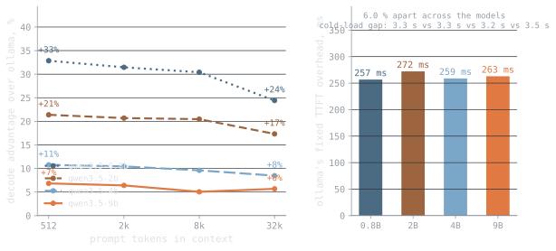{.dark-content fig-alt="Line chart: ollama overhead in percent against context depth, per model"}

**Figure 4.** The wrapper tax across the ladder, measured at each depth: qwen3.5-0.8b +32.9 %, qwen3.5-2b +21.4 %, qwen3.5-4b +10.8 %, qwen3.5-9b +6.8 % at 512 tokens. The overhead is a fixed cost, so it shrinks in percentage terms as the model gets slower.

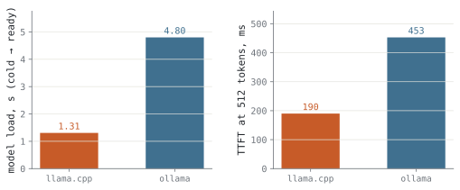{.light-content fig-alt="Bar chart: model load time and first-token latency per runtime"}
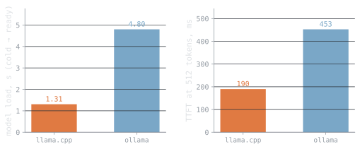{.dark-content fig-alt="Bar chart: model load time and first-token latency per runtime"}

**Figure 5.** Cold start and the fixed price of the wrapper. llama.cpp is serving 1.31 s after launch, ollama 4.80 s — a 3.49 s gap, plus 262.9 ms on every first token.
<!-- llmbench:generated:end wrapper -->

<!-- llmbench:commentary:begin wrapper-notes -->
*TODO — commentary.*
<!-- llmbench:commentary:end wrapper-notes -->

<!-- llmbench:generated:begin context hash=1c666753f4ab -->
## In depth — the knobs that change what you can run

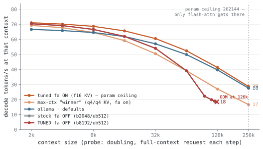{.light-content fig-alt="Line chart: decode speed along each configuration's context ladder"}
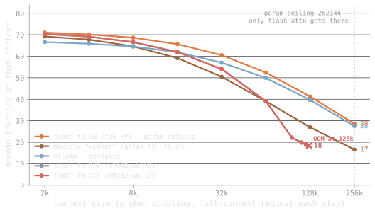{.dark-content fig-alt="Line chart: decode speed along each configuration's context ladder"}

**Figure 6.** Decode speed along each configuration's context ladder, out to the point where it stops. Speed at the limit is what decides whether a long context is usable rather than merely loadable: flash-attn on manages 28.6 tokens/s at 262 144 tokens; ollama defaults manages 27.5 tokens/s at 262 144 tokens; llama.cpp stock manages 18.4 tokens/s at 126 976 tokens; flash-attn off manages 18.4 tokens/s at 126 976 tokens; the max-context winner manages 16.6 tokens/s at 262 144 tokens.

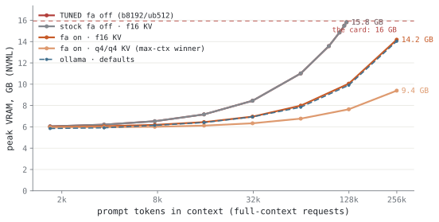{.light-content fig-alt="Line chart: peak VRAM against context depth per configuration"}
{.dark-content fig-alt="Line chart: peak VRAM against context depth per configuration"}

**Figure 7.** Peak VRAM as context grows, and where each configuration stops: flash-attn off 15.82 GB, llama.cpp stock 15.82 GB, flash-attn on 14.18 GB, the max-context winner 9.40 GB, ollama defaults 14.03 GB at its deepest completed request.
<!-- llmbench:generated:end context -->

<!-- llmbench:commentary:begin context-notes -->
*TODO — commentary.*
<!-- llmbench:commentary:end context-notes -->

<!-- llmbench:generated:begin flat hash=77fcd0665b1c -->
## In depth — the knobs that don't matter

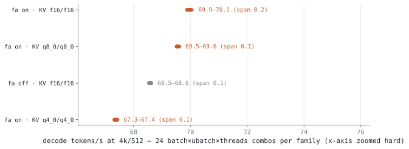{.light-content fig-alt="Strip plot: decode speed of every refine configuration, by family"}
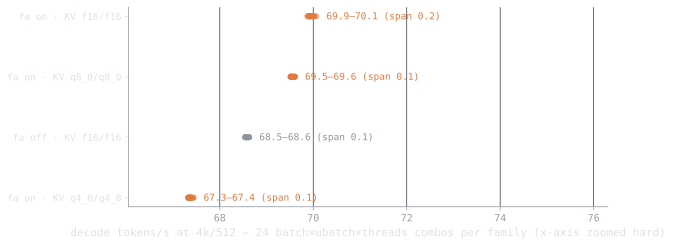{.dark-content fig-alt="Strip plot: decode speed of every refine configuration, by family"}

**Figure 8.** Every batch, micro-batch and thread combination the refine stage measured (96 configurations). Within a family the whole spread is 0.19 tokens/s; between families it is 2.7 — the flat knobs are flat, and the categorical ones are not.
<!-- llmbench:generated:end flat -->

<!-- llmbench:commentary:begin flat-notes -->
*TODO — commentary.*
<!-- llmbench:commentary:end flat-notes -->

<!-- llmbench:generated:begin power hash=d33cc2d9b3dc -->
## Power and energy

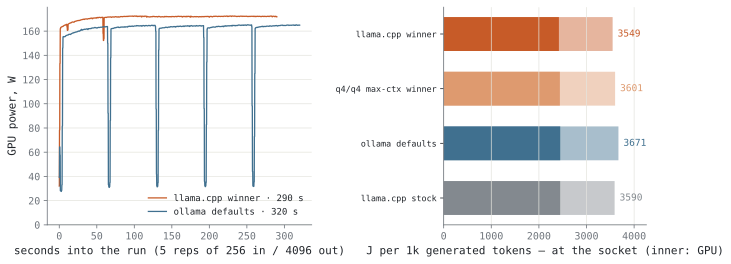{.light-content fig-alt="Power timeline plus bars of joules per 1000 generated tokens"}
{.dark-content fig-alt="Power timeline plus bars of joules per 1000 generated tokens"}

**Figure 9.** Power over a long generation, and the honest energy figure it integrates to — joules per 1000 generated tokens: the funnel winner 2 420 J, the max-context winner 2 441 J, llama.cpp stock 2 447 J, ollama defaults 2 448 J. Ranking by average watts would invert this. These are card joules; the CPU package adds 449–492 J on top, so ollama defaults really costs 2 940 J per 1000 tokens. At the wall socket the whole box costs 3 549 J per 1000 tokens for the funnel winner — 680 J more than the counters see, which is the PSU, the RAM, the fans and the drives.

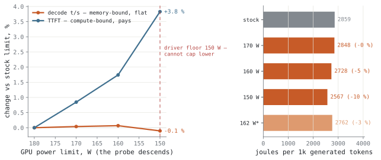{.light-content fig-alt="Bar chart: decode, latency and energy against GPU power limit"}
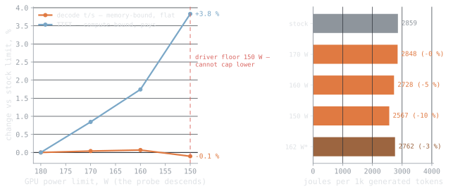{.dark-content fig-alt="Bar chart: decode, latency and energy against GPU power limit"}

**Figure 10.** What capping the card's power limit costs. At 150 W — 30 W below stock — decode changes by −0.10 %, time-to-first-token by +3.8 % and energy per 1000 tokens by −10.2 %. Decode is bandwidth-bound, so starving compute is nearly free.
<!-- llmbench:generated:end power -->

<!-- llmbench:commentary:begin power-notes -->
*TODO — commentary.*
<!-- llmbench:commentary:end power-notes -->

<!-- llmbench:generated:begin scoreboard hash=a6a716b81ea1 -->
## The tuning scoreboard

| Objective | ollama defaults | tuned llama.cpp | delta |
|---|---|---|---|
| Decode @ 512 tokens | 66.8 t/s | 71.4 t/s | +6.9 % |
| Decode @ 32k | 57.1 t/s | 60.4 t/s | +5.8 % |
| Time-to-first-token @ 512 | 452.9 ms | 190.0 ms | −58.0 % |
| Cold start | 4.80 s | 1.31 s | −3.49 s |
| Energy per 1000 tokens (wall) | 3 671 J | 3 549 J | −3.3 % |

Max context is the objective the table cannot hold, because it is not an ollama-versus-tuned question: across tuned configurations it ranges from 126 976 to 262 144 tokens — a spread of 2.1× on one card.

Against llama.cpp's own stock settings rather than ollama's, the numeric knobs are worth +1.4 % decode — the categorical ones are where the tuning value is.
<!-- llmbench:generated:end scoreboard -->

<!-- llmbench:generated:begin translations hash=886767946fb3 -->
## What this means in human units

| Configuration | A 100-page PDF | Reads back at | Cost per 1M tokens |
|---|---|---|---|
| Out of the box (ollama defaults) | 33.5 s (24.7 s reading + 8.8 s writing) | 51 words/s, 12.7× a human reader | <span data-kwh-per-1m="1.01961">€0.2549</span> |
| Tuned for throughput | 32.0 s (23.7 s reading + 8.3 s writing) | 54 words/s, 13.4× a human reader | <span data-kwh-per-1m="0.98572">€0.2464</span> |
| Tuned for context | 34.0 s (24.0 s reading + 10.0 s writing) | 53 words/s, 13.2× a human reader | <span data-kwh-per-1m="1.00025">€0.2501</span> |

<!-- llmbench:site-only:begin -->

Price it at your own tariff — the table above is computed at 0.25 €/kWh.

<div class="llmbench-price">
  <label for="llmbench-kwh">Electricity price</label>
  <input type="range" id="llmbench-kwh" min="0.10" max="0.50" step="0.01"
         value="0.25" aria-describedby="llmbench-kwh-out">
  <output id="llmbench-kwh-out">0.25 €/kWh</output>
</div>
<script>
(function () {
  var slider = document.getElementById("llmbench-kwh");
  var out = document.getElementById("llmbench-kwh-out");
  if (!slider || !out) return;
  function apply() {
    var price = parseFloat(slider.value);
    out.textContent = price.toFixed(2) + " \u20ac/kWh";
    document.querySelectorAll("[data-kwh-per-1m]").forEach(function (el) {
      var kwh = parseFloat(el.getAttribute("data-kwh-per-1m"));
      el.textContent = "\u20ac" + (kwh * price).toFixed(4);
    });
  }
  slider.addEventListener("input", apply);
  apply();
})();
</script>
<!-- llmbench:site-only:end -->

A "page" here is 650 tokens and a summary is 500; reading speed converts tokens to words at 0.75 and compares against 240 words per minute. Energy is GPU board power only — no power supply losses, no CPU, no fans.
<!-- llmbench:generated:end translations -->

<!-- llmbench:commentary:begin standout -->
## What stood out

*TODO — commentary.*
<!-- llmbench:commentary:end standout -->

<!-- llmbench:generated:begin repro hash=3eabe3486718 -->
## Reproducing this

Every number in this post was produced by the pipeline from committed results — none of it is typed by hand. To reproduce:

```
bench run --model qwen3.5-9b --hw-profile budget --runtime llama.cpp@b10068
bench run --model qwen3.5-9b --hw-profile budget --runtime ollama@v0.32.1
bench analyze --model qwen3.5-9b --hw-profile budget
bench stage qwen3.5-9b --hw-profile budget
```

Benchmark suite `v1`, results commit `2722d64`. Prompts are cut to exact token counts with the model's own tokenizer and output length is forced, so every configuration processes and generates exactly the same number of tokens. Reported values are medians over repetitions with the inter-quartile spread; out-of-memory outcomes are recorded as data, not discarded.

[Open the full board for this model](board.html) — every figure, including the ones that did not make the post.
<!-- llmbench:generated:end repro -->
